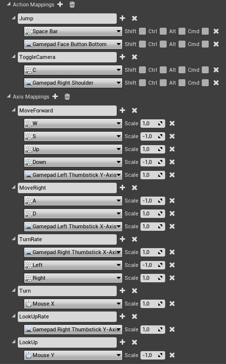

# Input

## **Manually configure control**

## **Import file with control settings**


Importing a file with control settings will overwrite the existing control.


You can also download a [file](https://drive.google.com/open?id=19pckzIFzwfN_rQPMn2u9WMqiNeDhPkks) with management settings and import it to **Project Settings -> Input -> Import**

.png>)
